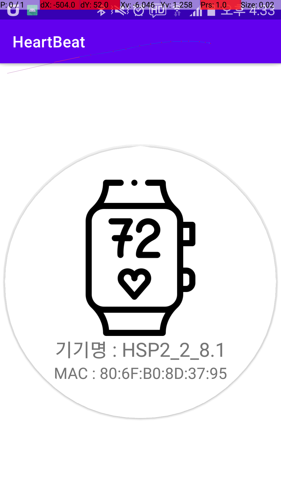

## RealTime Blood Pressure

MAXMIM 사의 손목형 헬스 디바이스 인 MAXREFDES 101과 안드로이드 스마트폰 어플리케이션을 이용하여
사용자의 체온, 심박수(ECG, PPG)를 측정하여 수집한 다음 수치와 실시간 그래프로 보여주고, 파일로 저장
하는 프로젝트입니다.

---

## Android Application Part
사용 언어 : Java, Kotlin

프로젝트 수행기간 동안은 java로 작업하였습니다. 구현된 버전의 저장소 위치는 다음과 같습니다.  
[링크]!

프로젝트가 끝나고 나서, kotlin으로 구현된 버전은 아래 저장소 위치에 있습니다.  
[링크]!

### Demo 

1. 블루투스 기기 선택화면  

{: width="50%" height="50%"}

BLE를 스캔할 때, 특정 서비스(기기)만 스캔되도록 UUID 필터를 추가해줌.

2. 메인 메뉴  

온도, PPG, ECG는 각각 Fragment로 구현되어 있음.

3. 체온 측정  

5. 심박수(PPG) 측정  

6. 심박수(ECG) 측정  

---

## Device Part
사용 언어 : C/C++

