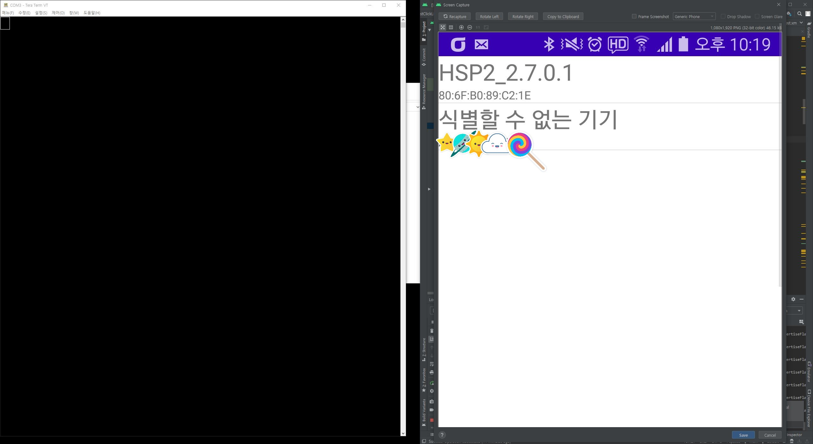
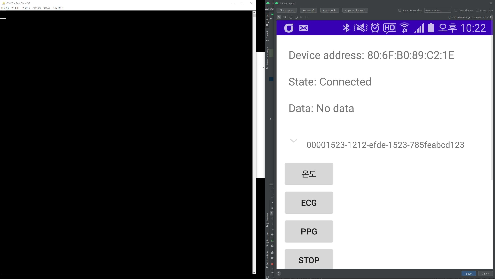
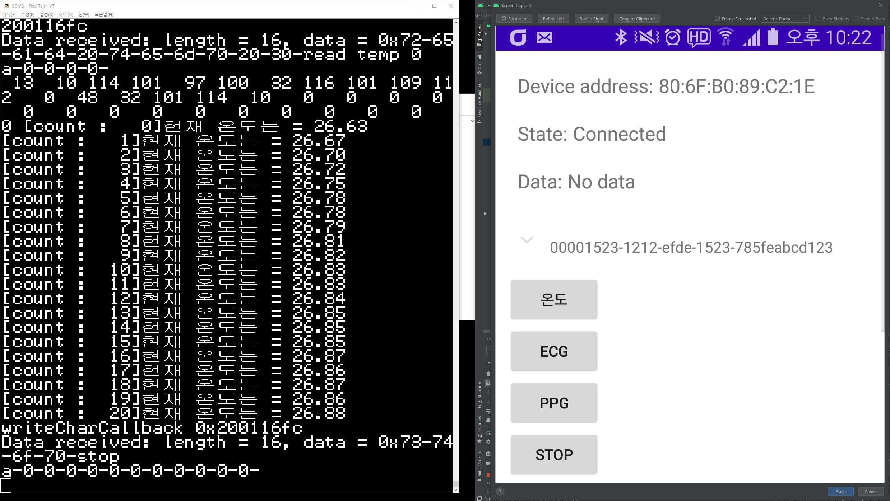

## To-do list

1. 블루투스 peripherals를 scan할 때, MAXREFDES101만 scan하도록

	-> 이건 scan할 때, 특정 service uuid만 scan하도록 하면 될듯
	
2. notify를 통해 데이터를 연속으로 받을 수 있도록

## 01.13일자

BLE connection, read, write됨
이제 notify이용해서 센서값 연속적으로 읽는 방뻐 구현

블루투스 장치 Scanning
나중에는 특정 디바이스만 스캔 되도록 해야할듯

중간에 server(MAXREFDES101)에서 제공하는 characteristic목록과 대응하는 uuid를 보여줌

온도 버튼을 클릭하면 정상적으로 write되어 시계에서 온도값을 보냄
마찬가지로 stop 커맨드도 정상적으로 write되어 센싱 중단 수행

## References

1. https://stackoverflow.com/questions/35436891/ble-android-write-characteristic-data

2. https://github.com/Fakher-Hakim/android-BluetoothLeGatt

3. https://developer.android.com/guide/topics/connectivity/bluetooth-le?hl=ko

4. https://jung-max.github.io/2019/09/06/Android-BLE-overview/

5. https://stackoverflow.com/questions/27068673/subscribe-to-a-ble-gatt-notification-android