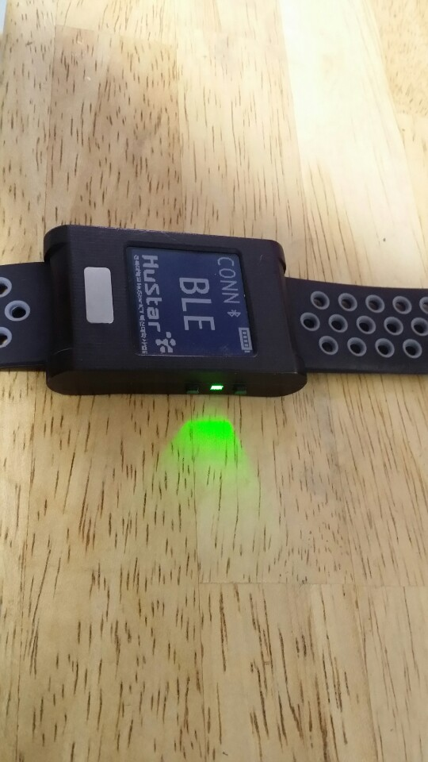
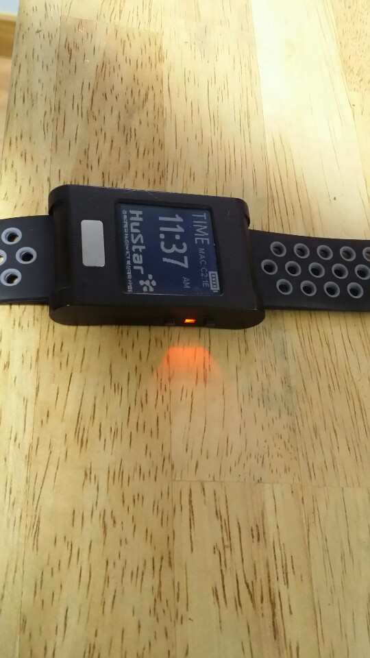

** void WatchInterface::updateDisplay(int batteryLevelToBeScaled)

display에 관한 전반적인 동작담당.
작은 font는 snprintf()로 표시할 수 있음.
호출되기전에 display.locate()를 통해 출력할 위치를 정할 수 있음.


1. 블루투스 connection 시도 

2. watchInterface.BLE_Interface_Exists가 true로 바뀜 (-> 어디서? 누가? )

3. dsInterface.stopcommand() 호출해서 모든 sensor들을 중단
	
	stopcommand()함수 가보면, 모든 센서에 대해서 센서개수만큼 stop함수 호출함
	
4. watchInterface.BLE_Interface_Exists = BLE::Instance().gap().getState().connected;

5. if (watchInterface.BLE_Interface_Exists || watchInterface.USB_Interface_Exists) 

6. 이 사이에 더 있는거 같음

7. process_ble();

여기서부터 연결을 기다리는거 같음

1. BLE::Instance().waitForEvent();
	
	mbed-os.features.FEATURE_BLE.source.(BLE.cpp)

2. 


일단 only 블루투스 connection과 disconnection만 됨

## Connection 성공



## Disconnection 성공(또는 평상시 연결이 안된 상태)




Drivers.Interfaces.DSInterface.cpp

Utilities.WatchInterface.cpp

```c++
//
// BLE
//

#include "BLE.h"
#include "BLE_ICARUS.h"
#ifdef ENABLE_BLETEST_COMM
#include "BleTestComm.h"
BleTestComm bleTestComm(&microUSB);
#endif
```

BLE.h에서는 user가 바로 BLE instance에 접근하기보다는 BLE instance를 가지고 있는 singleton(s)로 부터 액세스하도록 해야한다.

mbed-os에서는 signal handling/process에 대한 mechanism이 먼저 설정되어야 하는데, 디자인 원칙에 따라 user가 직접 mechanism을 구현할 필요없이
API를 사용해서 처리. onEventsToProcess() -> processEvents()

그런다음 일반적으로 BLE event mechanism을 Mbed EventQueue와 bind함.


***

기존 블루투스(2.0 or 3.0)과 달리 해당 개발키트는 4.0을 사용하고 이를 BLE(Bluetooth Low Energy, 저전력 블루투스)라고 함.
기본적인 매커니즘은 기존의 블루투스는 항상 연결된 상태를 유지하는데비해, BLE는 Advertising(Broadcasting)을 사용하여 적은 양의 데이터는 연결된 상태가아닌
일방적으로 데이터를 송출하도록 함. 하지만 unidirectional communication이나, 많은 양의 데이터를 받으려면 예전과 같은 connection방식을 사용해야 함.


***

***

```c++
void writeCharCallback(const GattWriteCallbackParams *params)
{
	uint8_t data[BLE_READWRITE_CHAR_ARR_SIZE] = {0};
	/* Check to see what characteristic was written, by handle */
	printf("writeCharCallback %p\r\n", Thread::gettid());
	if(params->handle == writeChar.getValueHandle()) {
		printf("Data received: length = %d, data = 0x",params->len);
		for(int x=0; x < params->len; x++) {
			if ((BLE_DS_INTERFACE != NULL) && (params->data[x] != 0)) {
				BLE_DS_INTERFACE->build_command((char)params->data[x]);
			}
			printf("%x-", params->data[x]);
		}
		printf("\n\r");
	}
	/* Update the notifyChar with the value of writeChar */
	BLE::Instance(BLE::DEFAULT_INSTANCE).gattServer().write(writeChar.getValueHandle(), data, BLE_READWRITE_CHAR_ARR_SIZE);
}
```

정확한지는 모르겟지만 여기서 params값을 통해 command 문자열 완성시킴 

후에 build_command() 호출 후에 cmd_str 문자열값을 parse_command()를 호출하여 해당되는 기능(temp, ecg, ppg)을 호출

***

***

## Send part(peripheral -> central)

```c++
int BLE_Icarus_AddtoQueue(uint8_t *data_transfer, int32_t buf_size, int32_t data_size) {
	int ret = 0;
	//printf("size is: %d\r\n", size);
	// TODO: Append a known character to the byte array in case size is
	// less than 20 bytes
	while ((data_size % BLE_NOTIFY_CHAR_ARR_SIZE) && data_size < buf_size)
		data_transfer[data_size++] = 0;
	mxm_assert_msg(!(data_size % 20), "BLE packet size must be multiple of 20 bytes");

	while(data_size > 0){
		ret = enqueue(&BLEQUEUE, data_transfer);
		data_size -= BLE_NOTIFY_CHAR_ARR_SIZE;
		data_transfer += BLE_NOTIFY_CHAR_ARR_SIZE;
	}

	if(ret != 0)
		printf("BLE_Icarus_AddtoQueue has failed\r\n");

	return ret;
}
```

***

여기서 salve가 master에게 데이터를 전송. 찾아보면 여러 센서 소스 코드(dsinterface, ecgcomm, sensorcomm, tempcomm)에서 해당 함수를 호출함

***
2020/12/29

```c++
					case DISPLAYMODE_PPG :

						// Before switching to PPG screen, stop all sensors
						if (!dsInterface.recordingStarted) {
							dsInterface.stopcommand();
							dsInterface.parse_command_str("set_reg ppg 2a 10");
							dsInterface.parse_command_str("set_reg ppg 23 ff");
							dsInterface.parse_command_str("read ppg 0");
						}

						break;
```

main.cpp에 있는 display mode에 관한 코드인데, Dsinterface.cpp에 가보면 set_reg에 관한 명령어는 정의가 되어 있지 않은거 같음

이것때문에 device studio에서 ppg값을 설정하거나 읽는게 안되는건지?

***

***

GATT 예제

https://os.mbed.com/teams/Bluetooth-Low-Energy/code/BLE_GATT_Example/

***

***

https://www.oreilly.com/library/view/getting-started-with/9781491900550/ch04.html

***

***

센싱 정보에 대한 데이터 패킷의 정보는 각 센싱comm.h파일에 확인할 수 있음.
현재 temp기준으로 작업중...

***

## Reference

BLE 관련 문서

1. [GAP, BLE 소개](http://www.hardcopyworld.com/ngine/aduino/index.php/archives/1132)

2. [Bluetooth 기술문서 블로그](http://www.hardcopyworld.com/gnuboard5/bbs/board.php?bo_table=lecture_iot&wr_id=11)

3. [안드로이드와 블루투스 통신하기](https://devbin.kr/mobile-%EC%95%88%EB%93%9C%EB%A1%9C%EC%9D%B4%EB%93%9C-%EB%B8%94%EB%A3%A8%ED%88%AC%EC%8A%A4-ble-%ED%86%B5%EC%8B%A0%ED%95%98%EA%B8%B0/)

4. [블루투스 개요및 BLE](https://m.blog.naver.com/min95701/220619132797)
